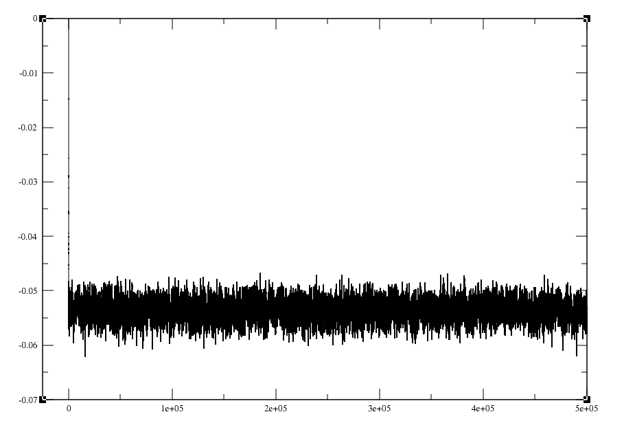

# NVT Monte Carlo

This is a program I wrote in late 2016, once I had started working at the [Space
lab](http://drbrian.space/) as an undergraduate. Dr. Space had a list of
exercises for new students to his lab that introduced us to the basics of
computational science; this program is an extension of those initial exercises.

I have since cleaned it up a little bit (mostly formatting and removing
particularly poor code snippets.) An "NVT" simulation attempts to describe the
behavior of a group of atoms/molecules/etc. (we referred to them as
`atomecules`!) under conditions of constant volume, constant temperature, and
with a fixed particle count. These conditions together make up the NVT, or
[`canonical`](https://en.wikipedia.org/wiki/Canonical_ensemble) ensemble.

## Using the program

Most any old C compiler should work just fine. Compile the main NVT program with
`make`. The program also requires a starting configuration, which
`startgenerator.c` provides. Compile that as `gcc startgenerator.c -lm`.

The startgenerator executable will walk you through generating an input file for
the main NVT program. After that, run the simulation as `./NVT`. This will
prompt for an amount of iterations. As of this writing (2020-06-13), my CPU
(Ryzen 5 3600x) can run 500,000 iterations of 125 Argon atoms in about 100
seconds. (NB: this produces an output file close to 2GB in size.)

The main NVT program outputs three files: `positions.xyz`, `energies.dat`, and
`free_energies.dat`. At the time, I would commonly visualize `xyz` files with
[VMD](http://www.ks.uiuc.edu/Research/vmd/). This still appears to be a good
solution; after having installed it, run `vmd positions.xyz`. I recommend
adjusting the Drawing Method as follows: `Graphics->Representations...->Drawing
Method->VDW->Apply`. This will allow you to view the simulation as the atoms
find their equilibrium positions (assuming it has run for a sufficient number of
iterations,) as well as provide a nice atomistic view of the simulation:

Graphing one of the energy files (below is `energies.dat` for 125 Argon atoms in
a 100\*100\*100 box), we find that the simulation does achieve a reasonable
equilibrium (that is, only small fluctuations of the system's potential energy
persist) rather quickly:

## Caveats
This program is full of bugs! It was my first attempt at writing a Monte Carlo
simulator. It was also one of my first times using `git`. There is a bit of
profanity and other instances of , er, "poor" commit message etiquette that I
hope you'll excuse.
